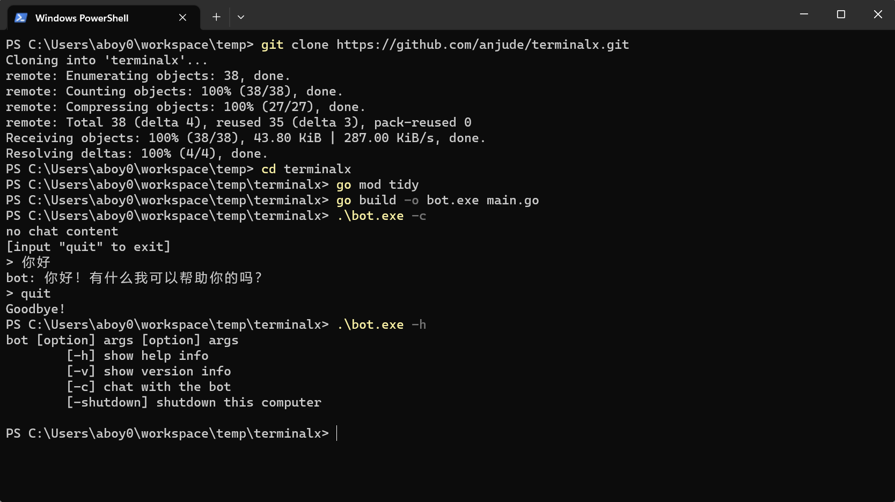

### TerminalX
terminal x，为你的terminal（终端）插上翅膀~

### 1. 简单使用
1. 准备好golang环境
2. 下载运行项目
```shell
git clone https://github.com/anjude/terminalx.git
cd terminalx
go mod tidy
go build -o bot.exe main.go
```
3. 把生成的bot.exe（mac、linux没有.exe扩展名）的目录放到环境变量下
4. 修改config.yaml文件，需要设置自己的api-key，按需设置代理端口，然后放到~/.terminal/config.yaml（~是用户目录，如C:\Users\aboy0）
5. 在终端运行bot -h查看帮助



### 2. 开发
1. 在handler目录新增一个自定义目录，可以参考version目录和version_handler.go文件
2. 新增的handler实现base.IHandler接口
3. 在handler/option_map.go文件定义命令和handler的关联
4. 重新编译文件（go build -o bot.exe main.go）即可
```go
type IHandler interface {
	// GetCommand 获取handler的命令
	GetCommand() (command string)
	// GetDesc 获取该命令的详情
	GetDesc() (desc string)
	// GetArgs 获取该命令需要的参数
	GetArgs(args []string) (curArgs []string, nextArgs []string)
	// Handle 该命令的具体执行逻辑
	Handle(args []string)
}
```
### 3. 联系作者
公众号：豆小匠Coding

